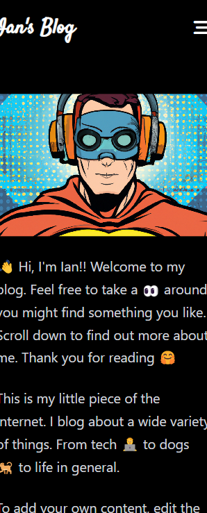
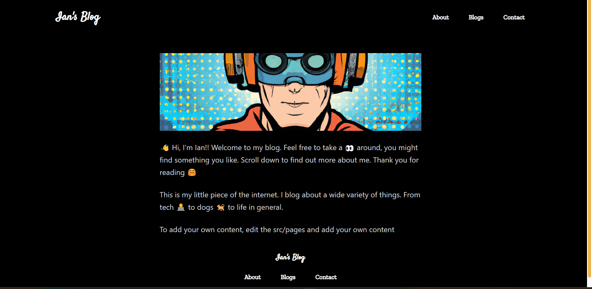
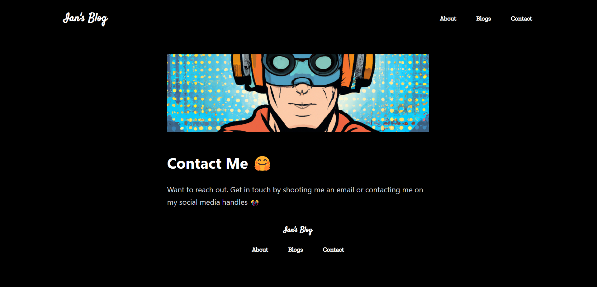

# Pesapal - Static Site Generator Solution

This is my solution to [problem 2 - Static Site Generator](https://pesapal.freshteam.com/jobs/2OU7qEKgG4DR/junior-developer-23)


### Problem Statement

**Problem 1: A static-site generator**

Design and implement a simple static-site generator. 

It should be able to 
- Take a folder containing Markdown (or another non-HTML markup-type format) pages and produce a website. - There should be support for a homepage, articles and supporting pages (e.g. an about page and some error pages).


### Screesnhots








## Prerequisites to run the app
- Nodejs needs to be installed to run the application


## Running the app

- clone or download the project
- Run `npm install` or `pnpm install` to install the necessary dependancies
- Once all the all the packages have been installed, run one of the two commands:

```bash
 `npm run dev` or `pnpm run dev`
```

 This command will open the application in development mode. This will build out the dist folder where your static files will live and watch for changes. 
- Navigate into the dist folder and open the index.html file using VSCode live server extension.

N/B: 
> Please keep node server running to see live changes


### Built with

- Semantic HTML5 markup
- Mobile-first workflow
- [Nodejs](https://nodejs.org/en/) - JS library
- [Expressjs](https://expressjs.com/) - Nodejs Web Framework
- [Tailwindcss](https://tailwindcss.com/) - For styles

## Dependancies
- [gray-matter](https://github.com/jonschlinkert/gray-matter)
- [Marked](marked.js.org)
- [Glob](github.com/isaacs/node-glob#readme)
- [Chalk](github.com/chalk/chalk#readme)
- [node-emoji](github.com/omnidan/node-emoji#readme)


## Author

- Website - [Ian Mugenya](https://ianmugenya.netlify.app/)
- Twitter - [@Mcbooll](https://twitter.com/McBooll)
